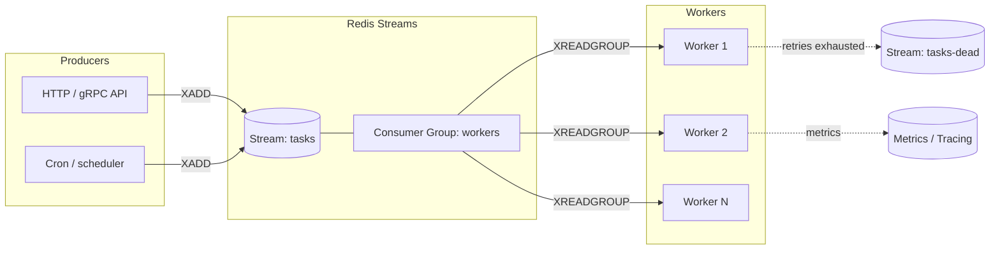
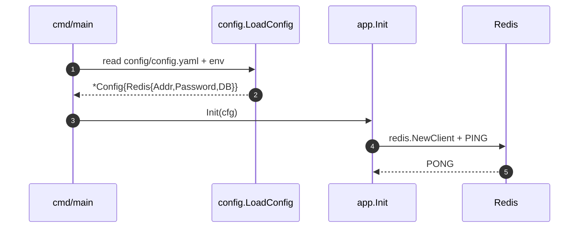

# taskq

> A scaffold for a Redis-backed distributed task queue in Go — Viper-driven config, single-instance Redis client, ready for fan-out + worker pool implementation.

[](https://github.com/Chetas1/taskq/actions/workflows/ci.yml)
[](https://github.com/Chetas1/taskq/actions/workflows/security.yml)
[](https://go.dev/dl/)
[](https://redis.io)

> **Status: scaffold.** This repo currently boots, loads YAML config, and connects to Redis. The producer/worker logic is the next milestone — see [Roadmap](#roadmap).

---

## Why this exists

A reference Go scaffold for the building blocks of a distributed task queue:

- **Viper-driven config** with file + env override (per `12-Factor`).
- **Single, dependency-injected Redis client** (avoids the global-singleton trap).
- **Clear seams** — `config`, `internal/app` — so producer and worker logic can be added without restructuring.

## Target Architecture



## Today's Code Path



## Configuration

`config/config.yaml`:

```yaml
redis:
  addr: "localhost:6379"
  password: ""
  db: 0
```

Env overrides (`viper.AutomaticEnv` planned): `REDIS_ADDR`, `REDIS_PASSWORD`, `REDIS_DB`.

## Roadmap

| Milestone                                        | Status |
|--------------------------------------------------|--------|
| Boot + Redis health-check                        | ✅     |
| Producer API: `Enqueue(task) -> taskID`          | ⏳     |
| Worker pool with at-least-once semantics         | ⏳     |
| Retry policy (exponential backoff + max attempts)| ⏳     |
| Dead-letter stream                               | ⏳     |
| Idempotency keys + dedupe                        | ⏳     |
| OpenTelemetry tracing                            | ⏳     |
| Prometheus metrics (queue depth, age, p99 latency) | ⏳   |
| Graceful shutdown (drain in-flight, ack) on SIGTERM | ⏳  |
| Integration tests with `dockertest` / `miniredis`| ⏳     |

## Operational Concerns (when implemented)

- **At-least-once delivery.** Plan to use Redis Streams + consumer groups; commit offsets with `XACK` only after handler succeeds.
- **Visibility timeouts.** `XCLAIM` on pending entries past the timeout (e.g. 5× expected handler latency).
- **Retries.** Exponential backoff with jitter; cap retries; drop to DLQ on exhaustion.
- **Backpressure.** Bound stream length with `MAXLEN ~ N`; expose queue depth as a metric.
- **Graceful shutdown.** Stop accepting new tasks, wait for in-flight workers up to a timeout, then `XCLAIM` to a clean-up consumer.

## Security Considerations

- **TLS to Redis.** Today: plaintext (`localhost`). Production: `rediss://` with CA bundle and cert pinning.
- **Auth.** Today: `password` in YAML. Production: env var or secret-manager-injected, never committed.
- **Payload trust.** Workers must treat task payloads as untrusted — validate, bound, and rate-limit.
- **Egress from workers.** If workers call external APIs, sandbox with timeouts + circuit breakers.

## Development

```bash
# Boot Redis (one-shot)
docker run -d --name redis-taskq -p 6379:6379 redis:7-alpine

# Run
go run .

# Lint + vet + vulnerability scan
go vet ./...
golangci-lint run
govulncheck ./...

# Stop Redis
docker rm -f redis-taskq
```

## License

See [LICENSE](LICENSE).
